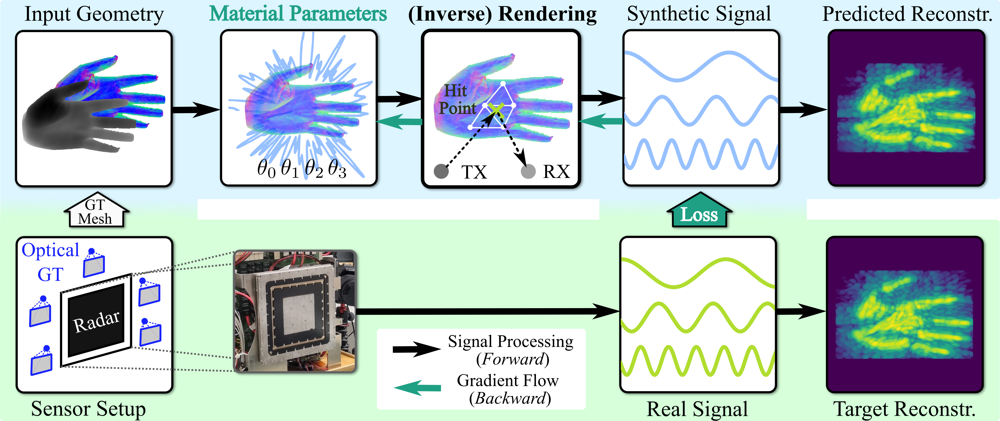

# Inverse Rendering of Near-Field mmWave MIMO Radar for Material Reconstruction

[![CC BY-NC 4.0][cc-by-nc-shield]][cc-by-nc]

[![CC BY-NC 4.0][cc-by-nc-image]][cc-by-nc]

[cc-by-nc]: https://creativecommons.org/licenses/by-nc/4.0/
[cc-by-nc-image]: https://licensebuttons.net/l/by-nc/4.0/88x31.png
[cc-by-nc-shield]: https://img.shields.io/badge/License-CC%20BY--NC%204.0-lightgrey.svg

Source code for our paper "Inverse Rendering of Near-Field mmWave MIMO Radar for Material Reconstruction".

### [Open Access PDF 🗒️](https://doi.org/10.1109/JMW.2025.3535077)

# Install

Clone repository with submodules using `git clone --recursive`, or initialize after cloning using `git submodule update --init --recursive`.

We use [Miniconda](https://docs.anaconda.com/miniconda/) to install dependencies and require a [NVIDIA OptiX](https://developer.nvidia.com/rtx/ray-tracing/optix) >= v8.0 capable GPU and driver.

    conda env create --file environment.yml
    conda activate inv-radar

# Download Dataset (MAROON)

See [MAROON](https://github.com/vwirth/maroon) (also included as a [submodule](submodules/maroon/README.md)), or download the example [MAROON Mini Dataset](https://faubox.rrze.uni-erlangen.de/getlink/fi43P9pBvMVCGz5xJSfRRM/maroon_mini.zip), and extract to a folder of choice.

# Run Optimization

To execute differentiable radar rendering with default parameters on any dataset in MAROON, use:

    python3 main.py /path/to/maroon/33_s2_hand_open/30

 To use a different dataset, simply replace the respective part of the path argument, i.e. `33_s2_hand_open/30`, accordingly. For example after extracting the [MAROON Mini Dataset](https://faubox.rrze.uni-erlangen.de/getlink/fi43P9pBvMVCGz5xJSfRRM/maroon_mini.zip) to `data/maroon_mini/`:

    python3 main.py data/maroon_mini/02_cardboard/30

Each optimization run can be examined via [Tensorboard](https://www.tensorflow.org/tensorboard), or by looking at the respective output in `runs/`, where a folder is created for each run using the following naming scheme: `runs/<datetime>_<hostname>-<dataset>-<hash>`.

Exemplary results for `02_cardboard/30` in layout (depth, normals, prediction, target, error map) using default parameters:

https://github.com/user-attachments/assets/69281d20-77d9-4072-9a68-a53cc0be7970

Exemplary results for `33_s2_hand_open/30` in layout (depth, normals, prediction, target, error map) using default parameters:

https://github.com/user-attachments/assets/3ae958b9-8b7e-4e31-bc6a-e8463d6170eb

# Ablation Studies

Run with different loss functions, as in Figure 9:

    python3 main.py /path/to/maroon/33_s2_hand_open/30 --loss [l1, l1_complex, l2, l2_reco]

Run with different material regularization (storage) options, as in Figure 10:

    python3 main.py /path/to/maroon/33_s2_hand_open/30 --material_storage [global, voxelgrid, hashgrid, vertex]

Run with different material models, as in Figure 11:

    python3 main.py /path/to/maroon/33_s2_hand_open/30 --material [0-4]

Run with different features turned on or off, as in Figure 12:

    python3 main.py /path/to/maroon/33_s2_hand_open/30 [--no_emptyfiltered, --no_reg_offset, --use_normalmap]

See `main.py` for a list of all possible command line arguments.
Note that the `--use_apc` option will raise an exception per default, since this requires additional information regarding the antenna radiation pattern, which is not publicly available.

# Acknowledgments

The authors would like to thank the Rohde & Schwarz GmbH & Co. KG (Munich, Germany) for providing the radar imaging device and technical support which made this work possible.
This work was (partly) funded by the Deutsche Forschungsgemeinschaft (DFG, German Research Foundation) – SFB 1483 – Project-ID 442419336, EmpkinS.
The authors gratefully acknowledge the scientific support and HPC resources provided by the Erlangen National High Performance Computing Center (NHR@FAU) of the Friedrich-Alexander-Universität Erlangen-Nürnberg (FAU) under the NHR project b201dc. NHR funding is provided by federal and Bavarian state authorities. NHR@FAU hardware is partially funded by the DFG – Project-ID 440719683.

# Citation (BibTex)

    @article{hofmann2025inverse,
        author={Hofmann, Nikolai and Wirth, Vanessa and Bräunig, Johanna and Ullmann, Ingrid and Vossiek, Martin and Weyrich, Tim and Stamminger, Marc},
        journal={IEEE Journal of Microwaves}, 
        title={Inverse Rendering of Near-Field mmWave MIMO Radar for Material Reconstruction}, 
        year={2025},
        pages={1-17},
        keywords={Backpropagation;MIMO radar;radar simulation;ray tracing;scattering parameters},
        doi={10.1109/JMW.2025.3535077}
    }
